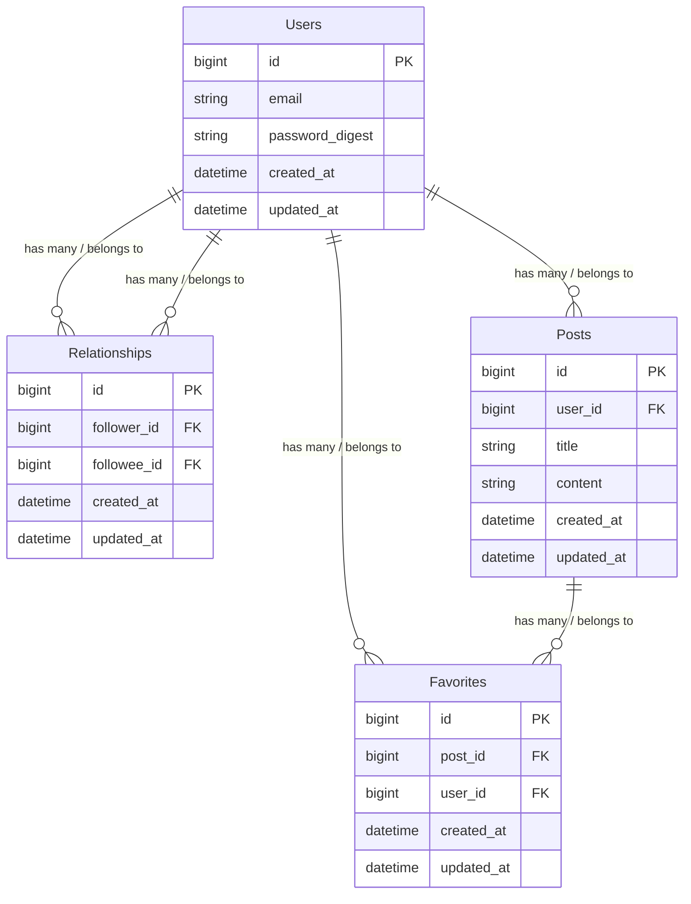

# さみだれ
## 概要
さみだれは、簡易的なSNSアプリケーションです。
### 主な機能
- ユーザー登録とログイン
  - ユーザーは、アカウントを作成し、ログインすることでアプリケーションを利用できます。
- 記事の投稿
  - ユーザーは、記事（140字以内のテキストメッセージ）を作成し、投稿できます。
- 記事の表示
  - ユーザーは、投稿された記事をタイムライン上で閲覧できます。
- 記事のいいね機能
  - ユーザーは、投稿された記事に対していいねをつけることができます。
- ユーザーフォロー機能
  - ユーザーは、他のユーザーをフォローすることができます。
### demo動画
[demo動画](https://github.com/user-attachments/assets/d06b207b-4261-453c-9f3c-9c5d6f96597f)

## アプリケーションを開発した目的
本アプリケーション開発を通じて、実際に使われている技術を使いながらWebアプリ開発について体系的に学び、Ruby on Railsを使った基本的なCRUD機能を持つアプリケーション開発についての知識やスキルを身につけることを目的とした。

## 工夫した点
- 開発環境構築にDockerを使用し、実際のチーム開発現場で利用される技術を身につける。
- Rubocopを導入してコードの品質を維持し、一貫したコーディングスタイルを確保する。
- RSpecでテストコードを書き、テスト駆動開発を意識して開発する。
- GitHub Actionsを導入してCIを組み、開発の効率化とコードの品質維持を図る。
- Active Recordが発行するSQLに注意し、パフォーマンスの向上を図る。
  - N+1問題の発生を回避する。
  - インデックスを使った効率的な検索を行う。

## 使用技術
| カテゴリー   | 技術                               |
| ---------- | --------------------------------- |
| バックエンド  | Ruby 3.2.2, Ruby on Rails 7.1.3.2 |
| フロントエンド | HTML, CSS, JavaScript, Bulma     |
| データベース  | MySQL 8.3.0                       |
| インフラ     | Docker                            |
| CI/CD      | GitHub Actions                    |
| その他      | Git, GitHub, RSpec, Rubocop       |

## Dockerを使った環境構築
### 環境構築手順
1. リポジトリをクローンする
```bash:ターミナル
$ git clone https://github.com/ok-os-job-change-team/tetsuya-twitter-clone-bootcamp.git
```
2. リポジトリに移動する
```bash:ターミナル
$ cd tetsuya-twitter-clone-bootcamp
```
3. イメージをビルドする
```bash:ターミナル
$ docker compose build
```
4. バックグラウンドでコンテナを起動する
```bash:ターミナル
$ docker compose up -d
```
### ページを表示する
- Railsサーバー起動後、Webブラウザで以下のURLにアクセスする。Railsサーバーは、appコンテナ起動時に起動する設定になっている。
```url:URL
http://localhost:3000/login
```
### そのほかのコマンド
- コンテナを停止し、作成したコンテナとネットワークを削除する
```bash:ターミナル
$ docker compose down
```
- 起動中のコンテナを表示する
```bash:ターミナル
$ docker ps
```
- 起動中のコンテナに入る
```bash:ターミナル
$ docker compose exec -it [コンテナ名] /bin/bash
```

## DBの作成
```bash:ターミナル
$ docker compose run app bin/rails db:create
```

## 画面遷移図
Figmaで作成した[画面遷移図](https://www.figma.com/design/3lGfphFnX3NnVuSAmIiTvy/twitter_clone_design?node-id=0-880&t=r3k2OVnkcEIi50Ko-1)（外部ページ）
## ER図

