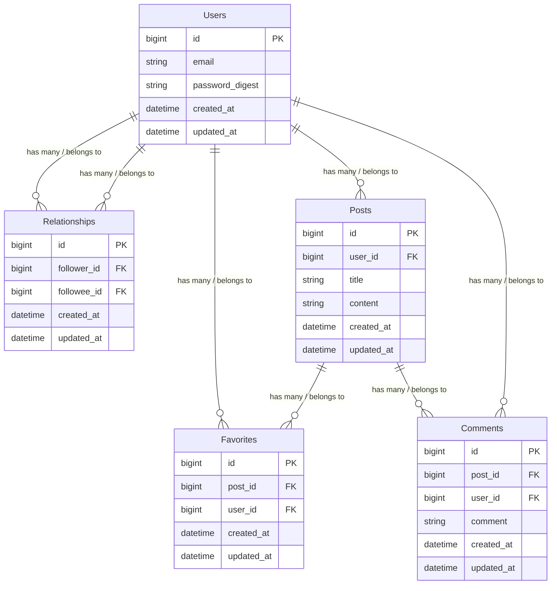

```mermaid
erDiagram

%% 1:0or多
Users ||--o{ Relationships : "has many / belongs to"
Relationships }o--|| Users : "has many / belongs to"
Users ||--o{ Posts : "has many / belongs to"
Users ||--o{ Favorites : "has many / belongs to"
Posts ||--o{ Favorites : "has many / belongs to"
Posts ||--o{ Comments : "has many / belongs to"
Users ||--o{ Comments : "has many / belongs to"

Users {
  bigint id PK
  string email
  string password_digest
  datetime created_at
  datetime updated_at
}
Posts {
  bigint id PK
  bigint user_id FK
  string title
  string content
  datetime created_at
  datetime updated_at
}

Favorites {
  bigint id PK
  bigint post_id FK
  bigint user_id FK
  datetime created_at
  datetime updated_at
}

Relationships {
  bigint id PK
  bigint follower_id FK
  bigint followee_id FK
  datetime created_at
  datetime updated_at
}

Comments {
  bigint id PK
  bigint post_id FK
  bigint user_id FK
  string comment
  datetime created_at
  datetime updated_at
}
```
