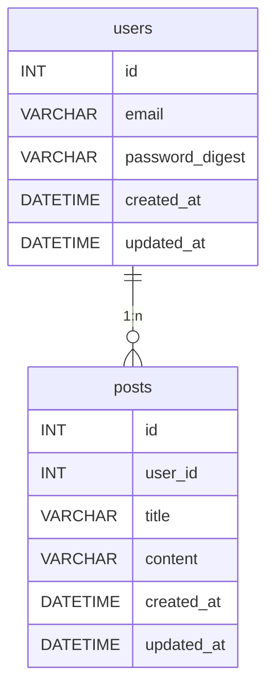

```mermaid
erDiagram

%% 1:0or多
users ||--o{ posts: "1:n"

users {
  INT id
  VARCHAR email
  VARCHAR password_digest
  DATETIME created_at
  DATETIME updated_at
}

posts {
  INT id
  INT user_id
  VARCHAR title
  VARCHAR content
  DATETIME created_at
  DATETIME updated_at
}
```
