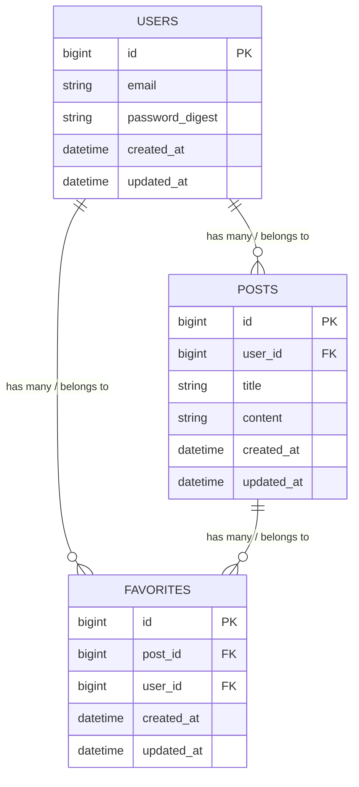
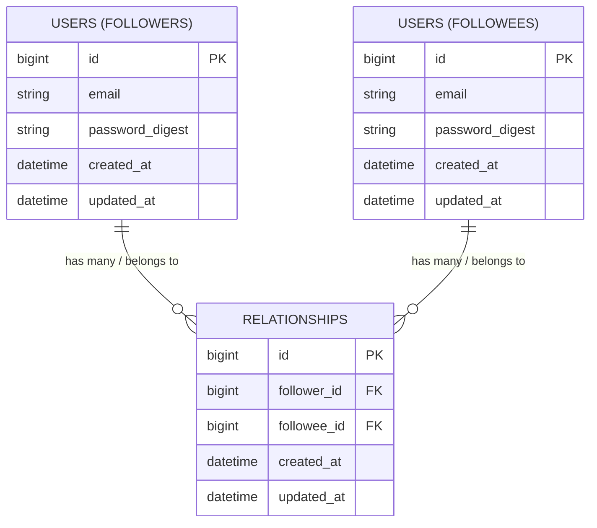

```mermaid
erDiagram

%% 1:0or多
USERS ||--o{ POSTS : "has many / belongs to"
USERS ||--o{ FAVORITES : "has many / belongs to"
POSTS ||--o{ FAVORITES : "has many / belongs to"

 USERS {
  bigint id PK
  string email
  string password_digest
  datetime created_at
  datetime updated_at
}

POSTS {
  bigint id PK
  bigint user_id FK
  string title
  string content
  datetime created_at
  datetime updated_at
}

FAVORITES {
  bigint id PK
  bigint post_id FK
  bigint user_id FK
  datetime created_at
  datetime updated_at
}
```
### ユーザーフォロー機能

```mermaid
erDiagram

%% ユーザーフォロー機能
"USERS (FOLLOWERS)" ||--o{ RELATIONSHIPS : "has many / belongs to"
"USERS (FOLLOWEES)" ||--o{ RELATIONSHIPS : "has many / belongs to"

"USERS (FOLLOWERS)" {
  bigint id PK
  string email
  string password_digest
  datetime created_at
  datetime updated_at
}

"USERS (FOLLOWEES)" {
  bigint id PK
  string email
  string password_digest
  datetime created_at
  datetime updated_at
}

RELATIONSHIPS {
  bigint id PK
  bigint follower_id FK
  bigint followee_id FK
  datetime created_at
  datetime updated_at
}
```